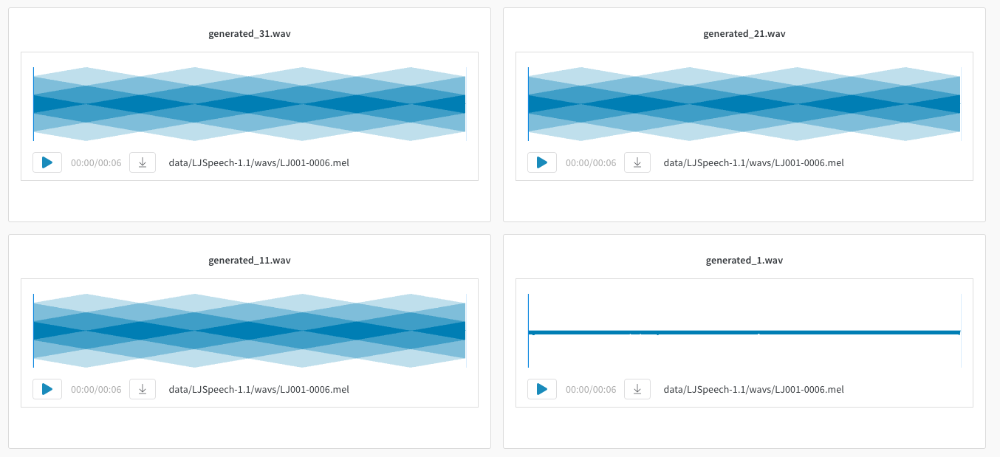
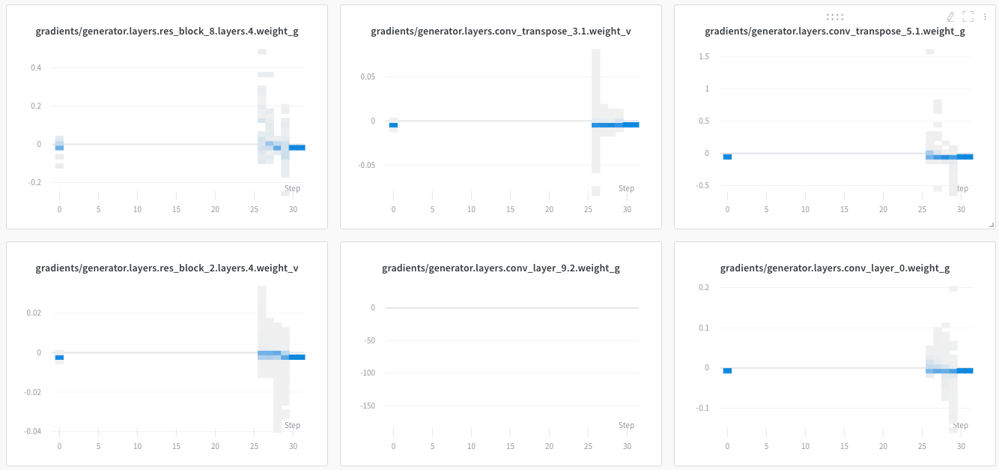

# Experiments & Results

All logs can be found [here](https://app.wandb.ai/torchwave/MelGAN).

### Experiments

Mainly all I tried is to remove some residual stacks and use one instead of three stacks in downsampling layer of generator. This leads to faster training but affects on quality, especially when there is a phrase instead of one separate word in text. Here is an examples of this approach \(there is underfiting but main idea is clear\).

#### Generated audio











Well, that's doesn't work.

So I follow a paper and add three residual stacks, as it was proposed. Next interesting thing, is that learning rate seriously affects on result. With big learning rate \( $$0.001$$ \) generator collapse and produces inappropriate quality audio with very low frequency artifacts.

If I use learning rate $$0.0001$$ situation becomes different. Now discriminator nearly collapse. But sound quality isn't so bad. Well there is metallic sound but words now recognizable.









The problem I noticed is that there is no gradients in some layers there is no gradients at all in first epochs. Maybe because discriminator can't handle generator at first.

 I think maybe I should do several discriminator steps in one training step to prevent discriminator from failing.

